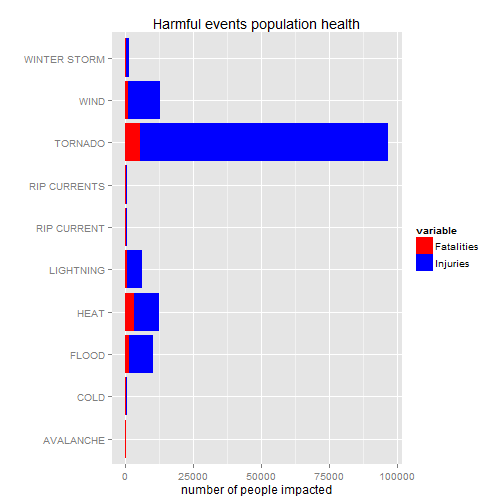

**Executive Summary**

This study attempts to identify America's most severe weather events. We define severe weather as any aspect of the weather that poses risks to life and causes damage. High winds, hail, excessive precipitation, and wildfires are forms and effects of severe weather, as are thunderstorms, downbursts, lightning, tornadoes, waterspouts, tropical cyclones, and extratropical cyclones. 
Regional and seasonal severe weather phenomena include blizzards, snowstorms, ice storms, and duststorms. Our analysis show that on average across the US, tornados were the most harmful to the population health. Additionaly tornados and had the greatest economic consequences.
The data for this project come from **NOAA Storm Database**

**Data Processing**

We will only extract the fields we will base our ananlysis on:

```
EVTYPE: The type of weather event (e.g. tornado, blizzard, thunderstorm).
FATALITIES: The number of fatalities attributed to the event.
INJURIES: The number of injuries attributed to the event.
PROPDMG: Property damage estimates in dollar amounts.
CROPDMG: Crop damage estimates in dollar amounts.
PROPDMGEXP: Metric prefix.
CROPDMGEXP: Metric prefix.
```


```r
setwd("C:/Users/geo/Documents/DS/Reproducible research")

#only extract the columns we need
mycols <- c(rep("NULL", 37))
mycols[c(1,2,8,23,24,25,26,27,28)]<- NA
data <- read.csv(bzfile("repdata-data-StormData.csv.bz2"),header=TRUE, colClasses=mycols)
data$BGN_DATE <- strptime(data$BGN_DATE, format="%m/%d/%Y %H:%M:%S" )

#convert to upper case
data$PROPDMGEXP<-toupper(data$PROPDMGEXP)
data$CROPDMGEXP<-toupper(data$CROPDMGEXP)
```

**Create a tidy data set** 


```r
data$evtype2<-as.character(data$EVTYPE)
data$evtype2[grepl("TSTM",data$EVTYPE,ignore.case=TRUE)]<-"TSTM"
data$evtype2[grepl("FLOOD",data$EVTYPE,ignore.case=TRUE)]<-"FLOOD"
data$evtype2[grepl("SNOW", data$EVTYPE,ignore.case=TRUE)]<-"SNOW"
data$evtype2[grepl("FREEZ|ICE|ICY|FROST", data$EVTYPE,ignore.case=TRUE)]<-"FROST"
data$evtype2[grepl("RAIN",data$EVTYPE,ignore.case=TRUE)]<-"RAIN"
data$evtype2[grepl("WIND",data$EVTYPE,ignore.case=TRUE)]<-"WIND"
data$evtype2[grepl("DRY",data$EVTYPE,ignore.case=TRUE)]<-"DRY"
data$evtype2[grepl("FOG",data$EVTYPE,ignore.case=TRUE)]<-"FOG"
data$evtype2[grepl("COLD",data$EVTYPE,ignore.case=TRUE)]<-"COLD"
data$evtype2[grepl("WARMTH|HEAT",data$EVTYPE,ignore.case=TRUE)]<-"HEAT"
```

**Metric prefixes**

Fields PROPDMGEXP and CROPDMGEXP contains the unit prefix that precedes the unit of measure to indicate a decadic multiple of the unit. There are 4 prefixes in our dataset. All pefixes correspond to an expoment (EXP):
`H = 100 USD ,K = 1000 USD, M = 1000000 USD, B = 1000000000 USD`

Count unique values in PROPDMGEXP field:

```r
as.data.frame(table(PROPDMGEXP=data$PROPDMGEXP))
```

```
##    PROPDMGEXP   Freq
## 1             465934
## 2           -      1
## 3           ?      8
## 4           +      5
## 5           0    216
## 6           1     25
## 7           2     13
## 8           3      4
## 9           4      4
## 10          5     28
## 11          6      4
## 12          7      5
## 13          8      1
## 14          B     40
## 15          H      7
## 16          K 424665
## 17          M  11337
```

Count unique values in CROPDMGEXP field:

```r
as.data.frame(table(CROPDMGEXP=data$CROPDMGEXP))
```

```
##   CROPDMGEXP   Freq
## 1            618413
## 2          ?      7
## 3          0     19
## 4          2      1
## 5          B      9
## 6          K 281853
## 7          M   1995
```


Next we will convert PROPDMGEXP and CROPDMGEXP to numeric fields:

```r
library(car)
data$PROPDMG2 <- data$PROPDMG * as.numeric(Recode(data$PROPDMGEXP, 
    "'B'=1000000000;'h'=100;'H'=100;'K'=1000;'m'=1000000;'M'=1000000;'-'=0;'?'=0;'+'=0", 
    as.factor.result = FALSE))
data$CROPDMG2 <- data$CROPDMG * as.numeric(Recode(data$CROPDMGEXP, 
    "'B'=1000000000;'k'=1000;'K'=1000;'m'=1000000;'M'=1000000;''=0;'?'=0", 
    as.factor.result = FALSE))
#calculate total damage
data$totalDamage<-data$PROPDMG2+data$CROPDMG2
```


**Take Subset of data**

Because fewer events were recorded in earlier years, this analysis will focus on only the most recent 10 years.

```r
chartData <- data[format(data$beginDate,format="%Y") > 2001,]
```

**Results**

**Aggregate the Human and Financial damages by Type of Event**


```r
#financial damages
library(reshape2)
financialdamage <- aggregate(cbind(PROPDMG2, CROPDMG2) ~ evtype2, chartData, sum)
fin <- melt(head(financialdamage[order(-financialdamage$PROPDMG2, -financialdamage$CROPDMG2), ], 10))

#population health
humandamages <- aggregate(cbind(FATALITIES, INJURIES) ~ evtype2, chartData, sum)
human <- melt(head(humandamages[order(-humandamages$FATALITIES, -humandamages$INJURIES), ], 10))
```


**Most harmful events for population health**


```r
library(ggplot2)
ggplot(human, aes(x = evtype2, y = value, fill = variable)) + geom_bar(stat = "identity") + 
    coord_flip() + ggtitle("Harmful events population health") + labs(x = "", y = "number of people impacted") + 
    scale_fill_manual(values = c("red", "blue"), labels = c("Fatalities", "Injuries"))
```

 


**Most harmful events for the economy**


```r
ggplot(fin, aes(x = evtype2, y = value, fill = variable)) + geom_bar(stat = "identity") + 
    coord_flip() + ggtitle("Harmful events for the economy ") + labs(x = "", y = "cost of damages in dollars") + 
    scale_fill_manual(values =  c("red", "blue"), labels = c("Property Damage", 
        "Crop Damage"))
```

 

**Conclusion**

From the results, we can see the following:
1. The most harmful weather events for population health is tornado.
2. The most harmful weather event for the economy is flood.

